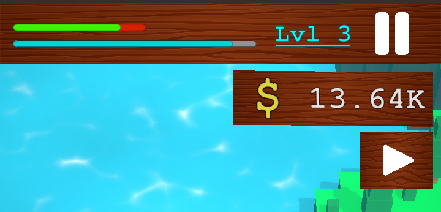
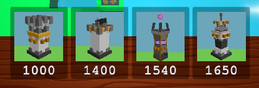

# Towaria Guide

## Basic Intro
Your goal is to get as far as you can, survive the waves of monsters which become more and more difficult with each level.
Each level has a unique layout so your strategies may adapt based on the level you're playing on.

## Waves
Enemies spawning is broken up by waves, a countdown is displayed in the middle of the screen before each wave starts.
When the countdown ends, enemies start spawning and you can purchase/place towers.
For each enemy that you defeat, you gain some money depending on the difficulty of the enemy.
What wave you are at is showin in our HUD, indicated by the blue progress bar, to see how far you are in the level. ([figure 1](#figure-1))

## Levels
At the end of each level, your statistics of that level and the total statistics are shown.
The level you are currently playing at is indicated in the HUD by "Lvl \[LEVEL\]" ([figure 1](#figure-1))

## Progression
If you progress to the next level, enemies will be scaled to be harder. (it takes more to defeat one, and they slowly get faster). 
All your placed towers will be removed, due to a new level being generated. Furthermore, the money is reset to a set amount, which does slowly scale each level. 
If your health bar runs out ([figure 1](#figure-1)), you will see the lose screen and will have to restart the level from the start.
Your placed towers and money will reset, just like it did when you first progressed to the level.

## Inputs
### Camera
You can move the camera by tilting it using one finger moving up and down on the screen.
Moving left and right is done by dragging one finger left or right. Zooming in or out is done with two fingers moving twoards or from one another.
### Shop and other buttons
At the bottom of the screen you can see a couple of buttons ([figue 2](#figure-2)), pressing one of these buttons will reveal info about this specific tower.
Below the image of the tower you can see how much this tower will cost you.
The tile will light up if you can afford it. 
If a tower is selected, you can place it on the grid that has now been made visible.
Once you press the grid and place the tower, this placement is permanent until a death resetting the level or progressing to a new level.

## Figures
#### Figure 1

#### Figure 2
 
*note: these prices are scaled due to them being bought a couple of times.*
